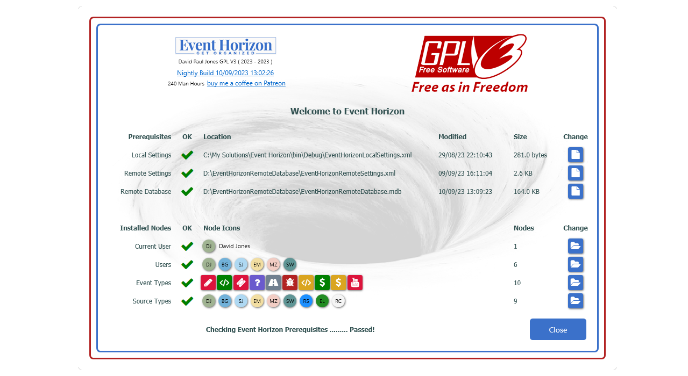
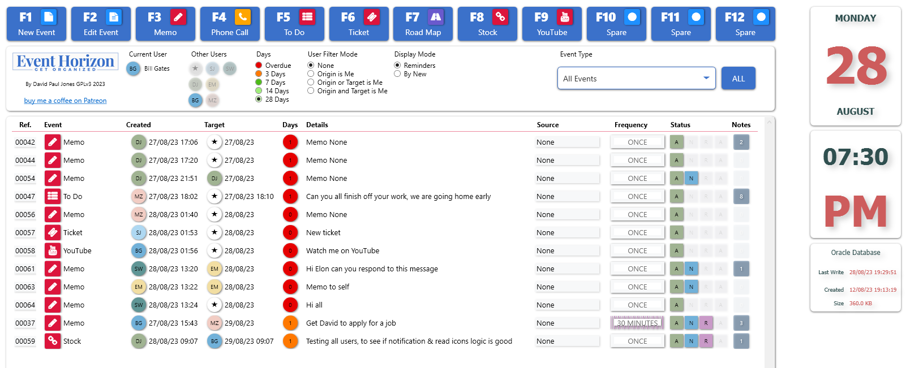

# Event-Horizon

Up coming Events odbc mdb database, single or multi-user, primary use is to get organized, XML Event Types &amp; XML Users List

## Table of Contents
- [About](#about)
- [Features](#features)
- [Getting Started](#getting-started)
- [Usage](#usage)
- [Contributing](#contributing)
- [License](#license)
- [Contact](#contact)

## About

Keep track of events, shows events becoming due, so they can be actioned, or postponed, add notes to an event, target users with events.
Main purpose is to set goals at when an event has to be actioned, if you are in charge of Health & Safety at your work place, you can setup events for ladder / harness / equipment inspections that have to be done at specific intervals, vehicle MOT's, training etc.
Event Horizon uses xml file to set event types & users, so this ability decouples what Event Horizon can do, so custom event types can be created in the xml file, that gets loaded upon Event Horizon startup. I use Event Horizon at work to look after Health & Safety, then use it at home to give myself a time frame to complete my projects by, like developing Event Horizon.

## Features

- List key features or functionalities that your project provides.
- Work stand alone or across a local area network
- Runs on Windows OS
- Local xml file to set user name, user icon color & database location
- Local or network based settings xml file, that sits in the database folder, which holds the event types, source types & function key assignments
- First 8 Event types in the xml settings file, associate themselves with the function keys F3 to F12
- Used FontAwesomeIcons, choose an icon to associate with an event type
- Uses a database file watch to refresh the main DataTable, all calculations and LINQ queries performed from this Table, instead of directly with the database, avoiding unnecessary database locks
- User icons on main window to show when users are running Event Horizon
- Built in notifications so targeted users don't miss any messages / events
- Events are tracked so the originator user knows if a event / message has been notified / read by the target user
- Create new blank database from within Event Horizon, browse & set database location
- Use it as an office, internal messaging system, create memo's / phone call / loggin etc
- Free to use, open source, buy me a coffee via my Patreon link if you find it useful
  
## Getting Started

Copy files to your hard drive, something like 'c:\Event Horizon\'
Goto that folder and edit 'OracleSettingsXML.xml' Oracle was just the project name while major works was done, now 'Event Horizon'
Goto the database folder & edit the main settings file 'OracleDatabaseSettingsXML.xml' change the event types to suit your requirements

## Usage

Show examples of how users can use your project in different scenarios. Include code snippets or screenshots.

## Contributing

Explain how others can contribute to your project. Mention guidelines for submitting bug reports, feature requests, and pull requests.

## License

This project is licensed under the GNU General Public License v3.0. See the [LICENSE](LICENSE) file for details.

## Contact

Email: davepauljones@gmail.com
YouTube: https://www.youtube.com/user/davepauljones
Twitter: https://twitter.com/davepauljones
Facebook: https://www.facebook.com/davepauljones
LinkedIn: https://www.linkedin.com/in/davepauljones
Instagram: https://www.instagram.com/davepauljones
UPAS Website: https://upasltd.co.uk/
C# Flat YouTube: https://www.youtube.com/@CSharpFlat 

Please get in touch with questions or feedback.

